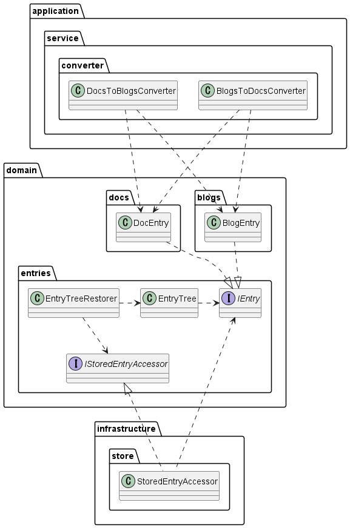

## obsidian-based documents & blog entries management tool

記載中

### 要件

### ツール利用にあたる前提事項

- ローカルは Obsidian を使用する前提（Obsidianを使用していなくても利用可)
    - mdファイル内の最初のタグを元にフォルダ階層を構築し自動的に配置する
        - 各記事の先頭のタグ (例：`#XXX`, `#XXX/YYY`, `#XXX/YYY/ZZZ`) がそのままフォルダ階層となる
        - 先頭のタグのパスがそのまま、その記事の配置先のフォルダのパスとなる

### 用語

- DocEntry： ローカルの記事(document)
- BlogEntry: ブログの記事
- CategoryPath： 記事に付けられた先頭のタグにより決定する配置先フォルダのパス

### 機能

- 作成した記事をローカルのdocumentフォルダへ格納＆ブログに投稿(ブログ投稿は選択可)
- documentフォルダ内の記事をブログに投稿
- ブログから投稿済み記事を収集してローカルに保存
- 記事の pickup フラグのON/OFF
- documentフォルダ内の記事を登録(ツール管理下に追加)
- documentフォルダ内の記事をタグに基づいて自動整理（ファイルの移動）
- 記事一覧ページ(Summary)を作成してローカルに配置＆blogに投稿

### 設計

簡易クラス図（※対象を絞っている＆実際のクラス名と異なる部分有り）

