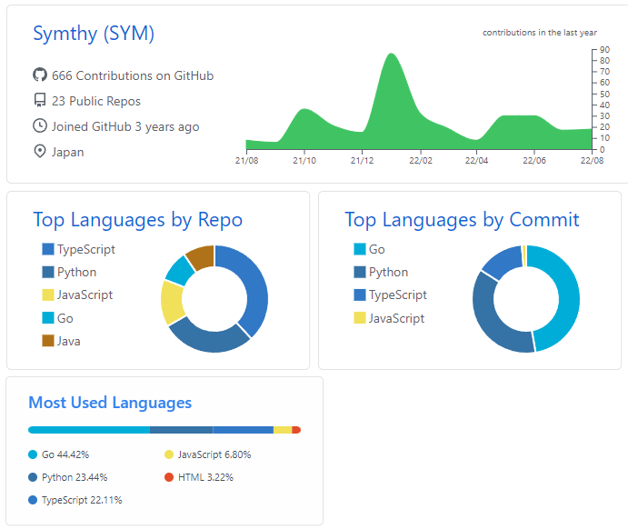

# Github プロフィールのカスタマイズ

自身の Github アカウント名と同じ名前のリポジトリを作ることで、プロフィールの最初に自身の好きな内容を追加することができる

ref: [プロフィールの README を追加する](https://docs.github.com/ja/account-and-profile/setting-up-and-managing-your-github-profile/customizing-your-profile/managing-your-profile-readme#adding-a-profile-readme)

以下の一部を導入

- [GitHub Readme Stats](https://github.com/anuraghazra/github-readme-stats)

    - 作成者が公開しているアプリケーションから取得する形で実現

- [GitHub Profile Summary Cards](https://github.com/vn7n24fzkq/github-profile-summary-cards)
    - 24h に 1
      回作成者が公開している[github-profile-summary-cards](https://github.com/vn7n24fzkq/github-profile-summary-cards)
      を実行することで、自身のブランチに svg を保存/更新、それを参照する形で実現

導入することで、以下のような Summary を作ることができる (2022/8/18 時点の内容)

## refs

詳細や導入方法は各ブランチか以下参照。

- [GitHub のプロフィールをカッコよくする方法 ① GitHub Readme Stats, Github Profile Trophy 編](https://zenn.dev/a_ichi1/articles/0411396e6b887d)

- [GitHub のプロフィールをカッコよくする方法 ② GitHub Profile Summary Cards 編](https://zenn.dev/a_ichi1/articles/64f353e23408b9)

- [github-profile-summary-cards Tutorial](https://github.com/vn7n24fzkq/github-profile-summary-cards/wiki/Toturial#add-personal-access-token-to-repo)

#Github #profile
